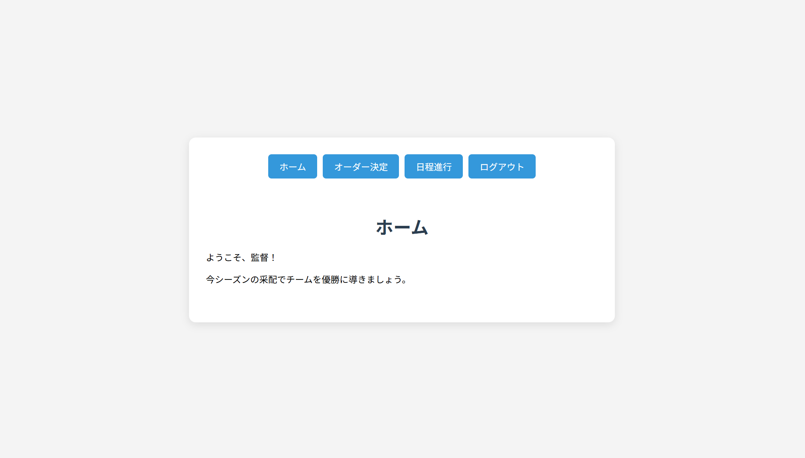

# 球団運営シミュレーションゲーム

## 企画したゲームの内容(制作中・未実装の機能あり)
プレイヤーはプロ野球リーグの1チームの監督として、チームを予算内で編成・采配してペナントレースを戦う。
他のチームはAIが編成・采配を担当する。（準備中、未実装）
※架空の球団・選手データを使用。
※選手の能力値は内部値にして、ユーザには選手の過去成績だけを見せる
※伸びる若手と即戦力ベテランの使い分けによってペナントレースの成績が決まるようなゲームバランスにする (予定、未実装)

## 従来の野球ゲームとの差異
- ユーザには選手の過去成績のみを見せる。ユーザには、データを見て選手の特性や課題を見極めることで、本当に自分が監督になったかのようなリアルな体験を提供する。
- 一試合だけでなく、ペナントレースを勝ち抜く戦略性を要求する。
- AIが一試合ごとに対戦相手のオーダーを決定する。ユーザーにもそれに応じて、オーダーを見直すことが求められる。


## 実装済みUI
### ログイン画面

### ホーム画面

### オーダー決定画面

### 試合進行画面


## webアプリの詳細
メニュー・オーダー・試合進行・ログイン/ログアウトの4画面を備えたSPAです。
バックエンドはFlaskで実装されています。
以下がアプリ構成予定です。


## 機能

### 実装済み
- ユーザー認証(ログインシステム)
- ユーザーごとにプレイデータを切り分けるデータベース構成
- 安全なログアウトシステム
- ユーザーによる、過去成績に基づいた自由なオーダー編成
- プライマリーキーによる選手の一意性保証
- 選手の能力を内部値、成績を表示値とする仕様
- 試合結果と選手の成績を連動させる仕様
- 選手能力を活用したリアルな試合ロジック

### 未実装・実装予定・今後の拡張
- AIバックエンドの追加
 [試験中のリポジトリ](https://github.com/gunjou-like/baseball_ai_src)。
 AI_ORDERとAI_STRATEGYの二つのAIエージェントを、Q-learningを使って学習させることを想定して準備を進めています。
 
- ペナントレースの試合スケジュール整備・順位表追加
- 選手の年齢データ追加。若手選手の成長ロジック。
- 投手の疲労反映、中継ぎ投手の追加。
- 選手のトレード、ドラフト


## セットアップ(テスト)

仮想環境内で依存パッケージをインストールします。
```
pip install -r requirements.txt
```
以下でapp.pyを実行します。
```
python app.py
```
2回目以降、テスト時起動前にDB(instance/users.db)の削除が必要です。